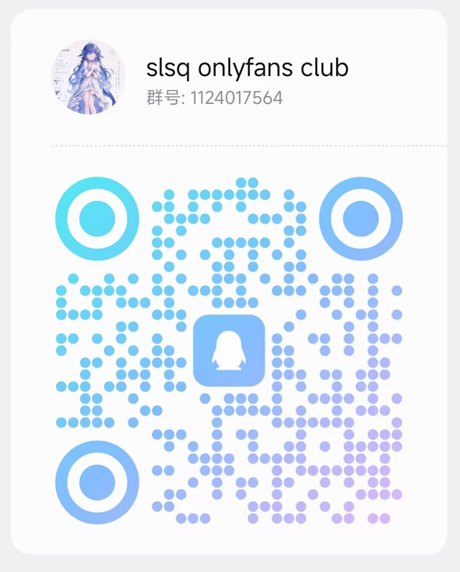

# ACM 训练台

一个只给自己用的 Codeforces 训练网站。输入用户名，它抓取你的过题记录和 rating，然后按目标 rating 生成训练计划、推荐该打的比赛、并给出赛后复盘。

## 怎么运行

### 方式一：桌面程序（推荐）

从 [Releases](https://github.com/DB-SLSQ/Acm-Tracker/releases) 下载 `ACM Trainer Setup x.y.z.exe`，双击安装。之后从开始菜单或桌面快捷方式打开，就是一个独立的窗口程序，不需要终端，也不需要浏览器。

程序的数据（题库缓存、训练进度）保存在 `%APPDATA%\acm-trainer\data\`，卸载重装不会丢。

### 方式二：网页版

前提：电脑上装了 **Node.js 22.5 或更高版本**（[官网下载](https://nodejs.org)）。

双击 `start.cmd`，或者在项目目录里执行 `npm start`，然后浏览器访问 <http://127.0.0.1:5173>。按 `Ctrl+C` 停止。

网页版**不需要 `npm install`**——后端零依赖，用的是 Node 自带的 SQLite。

### 自己打包桌面程序

```bash
npm install      # 只有打包桌面版才需要，会下载 Electron（约 200MB）
npm run desktop  # 开发模式直接运行桌面窗口
npm run build    # 生成安装程序，产物在 dist/
```

如果下载 Electron 卡住（国内网络常见），先设置镜像：

```bash
set ELECTRON_MIRROR=https://npmmirror.com/mirrors/electron/
set ELECTRON_BUILDER_BINARIES_MIRROR=https://npmmirror.com/mirrors/electron-builder-binaries/
```

### 验证桌面程序是否正常

```bash
npx electron scripts/desktop-smoke.mjs
```

会以隐藏窗口启动，检查页面是否渲染成功、有没有 JavaScript 报错，然后退出。

### 如果 `npm start` 报「因为在此系统上禁止运行脚本」

这是 Windows PowerShell 的默认执行策略拦住了 npm 的包装脚本（`npm.ps1`），和本项目无关。任选一种即可：

- 直接双击 `start.cmd`；
- 在当前窗口执行 `.\start.cmd`（批处理文件不受执行策略限制）；
- 跳过 npm，直接运行 `node --no-warnings server.js`；
- 或者换用 CMD 或 PowerShell 7（`pwsh`），它们的默认策略允许运行。

想彻底解决，可以在 Windows PowerShell 里执行一次：

```powershell
Set-ExecutionPolicy -Scope CurrentUser RemoteSigned
```

这只对当前用户生效，不需要管理员权限，想撤销就把它设回 `Undefined`。

## 功能

### 记住你的账号和设置

第一次输入 Codeforces 用户名、设定目标分数之后，这些都会存进本地数据库。以后每次打开就直接进入你的训练计划，不用重新输入。

设置存在服务端而不是浏览器里，所以桌面版和网页版行为一致——桌面版每次启动的端口是随机的，浏览器存储在这种情况下会失效，这也是把它放进数据库的原因。

### 训练计划

设定目标 rating 和每周能投入的题量，得到分阶段的题目清单。做完一道勾选一道，进度自动存在本地。

### 混入 AtCoder 的题

默认只用 Codeforces 的题。在「设置 → 题目来源」里勾上「训练计划里加入 AtCoder 题」，填上 AtCoder 用户名并同步一次，题单里就会按比例混进 AtCoder 的题（ABC / ARC / AGC），大约每天一道；不勾就是纯 CF，行为和以前一样。

- 题目表、难度估计和提交记录都来自 Kenkoooo 的 AtCoder Problems 公开接口，不需要登录 AtCoder，也不会向它提交任何东西；
- Kenkoooo 的难度是 IRT 估计值，量级比 CF rating 低一截，统一加 200 折算成练习区间里的分值（实测 ABC-C 约 400~530、ABC-D 770~900、ABC-E 1350~1390、ABC-F 1600~1850、ABC-G 2060~2340，ARC-C 约 2070）；
- AtCoder 官方不给算法标签，所以这些题只参与难度分配，不进八个方向的配额，也不算进能力画像；题单里会带一个 AtCoder 角标，鼠标悬停能看到它自己的难度值；
- 提交记录按游标增量同步，做过的题会自动排除、自动打勾；题库 7 天才换一次，不用天天抓。

### 洛谷题库

洛谷的练习页只能拿到「你做过哪些题」，题目本身（难度、算法标签、通过人数）得从题目列表页抓。设置 → 洛谷里选好难度档再点「抓取题库」：

- 按难度档**等距抽页**抓（每档 8 页 ≈ 400 题），单线程 1.2 秒一个请求。入门档默认不抓（对训练没意义），除入门之外的 7 档一次抓完约 64 个请求、86 秒；实测连着翻页没有被拦，这里还留了余量；
- 入库是**按难度档替换**的：先抓普及、过几天再抓提高，普及那批不会被清掉，设置里能看到各档分别抓了多少；
- 抽页而不是只抓前几页：默认排序下前面几页都是十几年前的老题，全收进来题单就偏了；
- 洛谷标签会翻成 Codeforces 的官方标签（模拟 → implementation、动态规划 DP → dp、并查集 → dsu…），这样八方向画像和单标签占比上限沿用同一套口径；年份、比赛来源、评测提示（Special Judge 之类）会被丢掉；
- 折算成练习分是按「档位分数段 + 档内摊开」做的：提高 1550~1850、提高+/省选− 1850~2100、省选/NOI− 2100~2350、NOI/CTSC 2350~2800 这样一段段接上去，同一档内部再按通过人数排（通过得多的排低分）。洛谷不给逐题难度，所以这是个估计值，界面上把鼠标停在「洛谷」角标上能看到真实档位；
- 同步洛谷练习页时会顺手把「做过的题」标出来，用来排除做过的题和自动打勾；洛谷记录没有时间信息，不进热力图和做题记录。

### 三个平台混排

设置 → 题目来源里勾上以后，题单按「四分之一 AtCoder + 四分之一洛谷 + 一半 CF」混排，各自**每天最多一道**：

- 一天四题就是两道 CF + 一道 AtCoder + 一道洛谷，日程里不会出现同一天两道同平台的题（排期时跨过休息日、某天没空这些边界也会再对一次）；
- AtCoder 没有官方算法标签，洛谷有 23% 的题自己没打标签，这两批只参与难度分配、不进八个方向的配额，能力画像也不受影响；有标签的洛谷题和 CF 题一样进方向配额；
- 不勾就是纯 CF，和以前完全一样。

### 训练日程

把计划落到具体日期上，而不是只给一个"每周多少题"。因为学生有课表，上班族有临时的事，计划必须能容得下这些。

- 勾选**每周固定休息**的日子（比如周末要补课），这些天不安排任务；
- 点日历上任意一天，可以标记**这天没空**并写上原因（"聚餐"、"期中考试"），当天不排题；
- 题目会自动顺延到后面的日子，**总题量不变**，只是完成时间相应推迟；
- 如果某一周已经过去一半才开始，第一周的题量会按剩余天数折算，不会把一整周的量压到两三天里。

### 活动记录

像 Codeforces 个人主页那样的方格图，一格一天，颜色越显眼表示那天过得越多。可以切换看「每天首次通过的题数」或「每天提交次数」，配色有绿、蓝、粉、橙、紫五种可选。

颜色深浅按你自己的活跃度分位计算，不会因为别人做得比你多就显得全都很淡。

### 界面主题

四套主题，随时切换，设置保存在本地：

- **暗色**：默认，深灰底
- **亮色**：白底深字，适合白天或投屏
- **灰色**：介于两者之间，比纯黑柔和
- **护眼**：暖绿纸色、低对比，长时间看屏幕更舒服

### 比赛日历

列出未来两周已公布的 Codeforces 比赛，换算成本机时区，并按你当前的 rating 标注这场「正合适 / 偏难 / 偏简单」。

### 虚拟参赛

从已结束的比赛里挑出适合你的场次，一键开始本地计时，赛后自动抓取你的提交生成复盘。

Codeforces 没有开放「注册虚拟赛」的接口，那一步需要你的登录态——本项目不会索取你的账号密码。所以流程是这样的：

1. 在训练台里点「开始虚拟赛」，本地开始计时，并列出这场比赛的题目。
2. 在 Codeforces 页面上正常做题、提交（可以自己先在 CF 上开正式虚拟赛，也可以就直接做）。
3. 计时结束后点「结束并复盘」，训练台会用官方 API 拉取这段时间里你在该场比赛的提交，算出解出几题、每题耗时、卡在哪、难度加权分。

两种做法都支持，因为复盘是按「比赛 + 时间窗口 + 提交记录」来算的，不依赖你是否在 CF 上注册了虚拟赛。

### 能力画像

把 Codeforces 的 35 个官方 tag 归成 8 个知识方向（基础与模拟、数据结构、图论与树、动态规划、数学、字符串、搜索与构造、贪心与思维），每个方向给出你的水平画像。

## 算法说明

**衡量一个专题的水平用 75 分位，不用最高难度。** 你偶然蹭过一道 2000 分的数据结构题，不代表数据结构就过关了。所以取你在这个 tag 上做过的所有题 rating 的 75 分位数作为代表值，并按样本量算一个置信度——做过 3 道题和做过 300 道题，结论的可信度显然不同。

**没做过的专题会单独标出来。** 这类盲区最该补，但它不在「已做过」的统计里，只看做过什么是发现不了的。

**弱项指数是 0~100 的可比刻度。** 你的 75 分位水平还在练习区间下沿以下就是 100（完全够不着），已经到区间中心就是 0（不拖后腿），中间线性过渡，再按样本量打折。

**分阶段爬坡。** 从当前 rating 到目标 rating 之间，每隔约 200 分切一个阶段，每阶段的练习区间取「该阶段目标分 -250 ~ +150」。这是公认效率较高的范围：既能巩固，又有适度挑战。

**选题时的三条规则。** 优先命中你的弱项专题；优先被大量人做过的题（质量稳定、套路清晰）；难度取区间中上段（太简单和太难都低效）。同时限制单个标签的占比（默认 40%，可在设置里调整），避免整份计划偏科，并且全计划去重，同一道题不会出现在两个阶段。

**难度合不合适，可以交给模型判断。** 内置规则看的是「这道题在练习区间里的相对位置」，比较粗。进阶做法是从真实比赛里学：把每场官方成绩展开成「某个人、赛前多少分、面对一道什么难度什么标签的题、最后做没做出来」，训练模型来预测「以你现在的水平做出这道题的概率」，挑概率在 55% 上下——有点挑战但做得出来的题。细节见下面「训练推荐模型」。

**题量估算。** 采用经验系数「每提升 100 分约 60 题」，再按你每周的题量换算成周数。这只是个大致节奏参考，不是精确预测。

**比赛推荐。** 一场适合虚拟参赛的比赛 = 题目难度落在你的练习区间 + 天花板高于你现在的水平 + 最简单的题你能上手 + 覆盖你的薄弱专题 + 你基本没做过。推荐理由里的每个数字都来自实际计算，没有依据的话不会写进理由里。

### 训练推荐模型

设置面板里有「推题模型」一节，填要采集多少场比赛，点开始训练即可；也可以直接跑命令：

```bash
npm run train                  # 默认 300 场，约十几分钟
npm run train -- --contests 20 # 先小规模试跑
npm run train -- --train-only  # 用已采好的样本重新训练
```

数据来自 Codeforces 官方接口，每场比赛两个请求（成绩单 + rating 变化），300 场大约 600 个请求，脚本按官方建议的 2 秒间隔串行发送。样本存在本地 SQLite 里，重跑会跳过已经采过的比赛。注意：非 gym 比赛的成绩单只接受不带额外参数的匿名请求，所以这里一页拿全场，再等距抽样控制在每场 200 多人。

模型是逻辑回归，特征只有比赛当场能拿到的信息：赛前 rating、题目难度、难度差、题目的知识方向（以及「方向 × 超纲程度」的交互项）、题目年代、题号位置。没有任何未来信息，所以离线评估的结果和真实使用时一致。

**模型不一定被启用。** 训练时会按比赛时间切分：较早的比赛用来训练，最近的 15% 留出来做检验，同时训练一个「只看难度差」的基线。只有当模型在留出集上的 AUC 不低于 0.75，并且明显优于基线（AUC 高 0.005 以上，或对数损失低 1% 以上）时才会启用；没赢过基线就继续用内置规则，界面上的说明也会写明原因。

为什么不学「做了这道题能涨多少分」：练什么题不是随机分配的，强的人既做难题也涨分，直接拿「做题 → 涨分」当标签，学出来的其实是「谁强」。而「给定赛前分数和题目条件，能否做出」是良定义的二分类问题，能被留出集检验。

## 技术结构

```
server.js                 HTTP 服务和接口
electron/main.js          桌面程序入口（启动内置服务 + 原生窗口）
lib/cf.js                 Codeforces API 客户端（串行限速，遵守官方 2 秒间隔）
lib/db.js                 SQLite 缓存
lib/knowledge.js          知识点建模：tag → 知识方向、分位数、置信度
lib/model.js              「能不能做出这道题」的模型：特征、训练、评估
lib/plan.js               训练计划与推荐算法
lib/contests.js           比赛日历、虚拟参赛推荐与复盘
public/                   前端页面（原生 HTML/CSS/JS，无构建步骤）
scripts/sync-problems.js  手动刷新题库
scripts/train-model.js    采集比赛数据并训练推题模型
scripts/desktop-smoke.mjs 桌面程序冒烟测试
scripts/desktop-shots.mjs 界面截图（视觉检查用）
data/trainer.db           你的所有数据（可随时删除重建）
```

桌面版和网页版共用同一套后端与界面代码：Electron 在随机空闲端口拉起内置服务，再用原生窗口打开它。题目链接、比赛链接一律交给系统浏览器打开，不在应用内跳转。

数据表：`problems` 题库、`users` 用户、`submissions` 提交记录、`rating_history` 比赛记录、`progress` 做题进度、`contests` 比赛目录、`virtual_sessions` 虚拟赛记录。

请求方面，同一个 Codeforces 请求最多 2 秒一次，并且做增量同步——只拉上次之后的提交，不重复全量下载。

接口一览：

| 方法 | 路径 | 说明 |
| --- | --- | --- |
| GET | `/api/user?handle=` | 抓取并缓存用户数据 |
| GET | `/api/plan?handle=&target=&weekly=` | 生成训练计划 |
| GET | `/api/calendar?days=14&handle=` | 未来赛程 |
| GET | `/api/virtual?handle=&target=&reviewId=` | 虚拟参赛状态、推荐、复盘 |
| POST | `/api/virtual/start` | 开始一场虚拟赛 |
| POST | `/api/virtual/finish` | 结束并生成复盘 |
| POST | `/api/progress` | 保存做题进度 |

## 已知限制

- 目前只支持 Codeforces。
- 虚拟参赛只做本地计时和复盘，不会替你操作 Codeforces 账号。
- 复盘里的「难度加权分」是各题难度之和，用来横向比较自己的成长，不是 Codeforces 官方 rating。
- 比赛日历只显示未来两周、且是官方已公布的场次。
- 题库每天更新一次，也可以手动跑 `npm run sync`。
- 题量系数、练习区间、占比上限都是常量，在 `lib/plan.js` 顶部可以直接调。

## 参考

知识点建模（tag 归方向、加权分位数、样本置信度）参考了 [OJ Insight](https://github.com/Whalica/OJ_Insight)（MIT 协议）的思路。那是一个用 Rust + React 写的多平台训练数据面板，做的是「把六个 OJ 的数据看清楚」；本项目做的是「告诉你下一步练什么」，两者互补。本项目没有使用它的任何代码，只是在统计口径上借鉴了它的做法。

## 交流反馈

用着有问题、想要什么功能，或者只是想找同好一起刷题，都欢迎加群。群里也会同步这个项目的更新。

**QQ 群：1124017564**（slsq onlyfans club）

手机 QQ 扫一扫下面的二维码就能进：



## 致谢

每一版的改动里都有一部分来自使用者的反馈，都记在这儿。

| 版本 | 提出建议的人 | 相关改动 |
| --- | --- | --- |
| v0.1.3 | [一只人畜无害的萌新吖](https://space.bilibili.com/1572872158)、Bezime、yf | 水平评估的排除区间、推荐题目优先近几年、题目永久屏蔽、洛谷难度档位修正 |

## 协议

[MIT](LICENSE)
